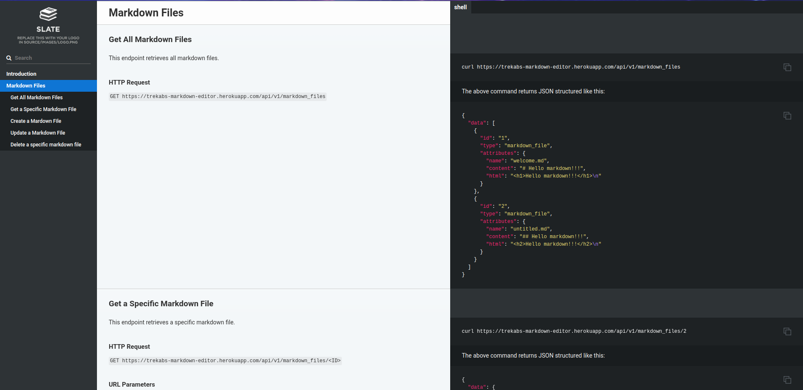

# Markdown Editor API
> This is an API for an `In-browser Markdown Editor` client that is aimed at enabling users to manage or conviniently edit their mardown files.

## Built With

- Ruby on Rails

## Documentation

[Documentation Link](http://trekab.io/markdown_editor_api_docs/)

## Getting Started

To get a local copy up and running follow these simple example steps.

To get a local copy up and running follow these simple example steps.

- `git clone git@github.com:trekab/markdown_editor_api.git`

Then you browse to the folder and exucute the following commands

- `cd markdown_editor_api`
- run `bundle install`
- run `docker compose run web rake db:create`
- run `docker compose run web rake db:migrate`
- run `docker compose up` and test out the `endpoints` from your preferred client.

`N.B:` _Ensure that you have [docker setup](https://docs.docker.com/get-docker/) for your environment to run the app locally!_

## Authors

👤 **Treasure Kabareebe**

- Github: [@trekab](https://github.com/trekab)
- Twitter: [@t_kabareebe](https://twitter.com/t_kabareebe)
- Linkedin: [Treasure Kabareebe](https://www.linkedin.com/in/treasure-kabareebe/)

## 🤝 Contributing

Contributions, issues and feature requests are welcome!

Feel free to check the [issues page](issues/).

## Show your support

Give a ⭐️ if you like this project!

## Acknowledgments

- [Docker QuickStart Guide](https://docs.docker.com/samples/rails/)

## 📝 License

This project is [MIT](lic.url) licensed.
